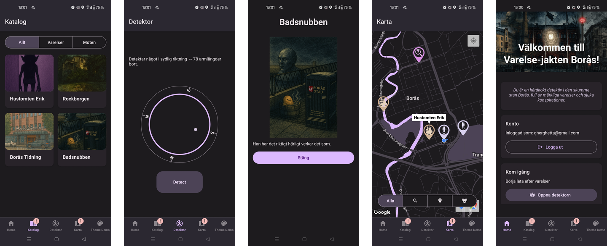
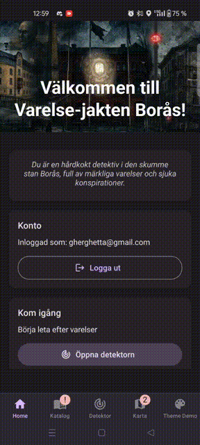

# Varelsejakt Borås - React Native App

En ARG-app byggd med React Native, Expo och TypeScript. Utforska Borås och samla märkliga varelser genom att använda mobilen som detektor!

## Projektbeskrivning

Användare skapar ett eget konto för att kunna spara sin progress i ett platsbaserat ARG. Genom GPS och kompassfunktionalitet kan man hitta varelser runt om i Borås och uppleva en AR-liknande spelkänsla.
Utöver samlandet kan man även följa ett noir-inspirerat mysterium som kretsar kring ett hemligt sällskap som styr staden.

### Detektorn

Spel-loopen bygger på användning av Detektorn: en skärm i appen där man trycker på en knapp för att se om det finns intressanta punkter i närheten.
När man är nära nog kan man "fånga" en varelse eller låsa upp en ny del av handlingen. Spelet använder chain-gating: vissa punkter blir tillgängliga först när andra redan har hittats.

### Kartan

Kartan visar både upptäckta punkter och “clues” (ledtrådar) som driver handlingen framåt. Kartan är stylad och kan förändras baserat på spelets händelse, t.ex. att Viskan färgas röd under vissa scenarion.

### Katalog

Här ser spelaren alla varelser och kartpunkter som hittats, såväl som ledtrådar som för spelaren vidare i mysteriet.



### Demo
Se demo-gif nedan där jag
- öppnar appen
- tittar på kartan för att se en clue
- öppnar mocking appen för att byta position
- använder detektorn för att se att jag är nära 
- flyttar närmre  mocking appen
- "fångar" och ser då min encounter
- uppdaterar katalogen manuellt fast det borde hänt automatiskt
- visar hur man kan filtrera kartvyn


---

## Teknisk stack
- **React Native** 
- **Expo** 
- **TypeScript** 
- **React Native Paper** (Material Design komponenter)
- **Expo Router** (Navigation)
- **Appwrite** (Backend-as-a-Service)
- **React Hook Form** + **Zod** (Formulärhantering)
- **React Native Maps** (Kartfunktionalitet)

## Hur man bygger och kör projektet

### Förutsättningar
- Node.js (version 18 eller senare)

### Installation

1. **Klona repot:**
   ```bash
   git clone [repository-url]
   cd poke
   ```

2. **Installera dependencies:**
   ```bash
   npm install
   ```

3. **Starta utvecklingsservern:**
   ```bash
   npm start
   ```

4. **Kör på plattform:**
   - iOS: `npm run ios`
   - Android: `npm run android`
   - Web: `npm run web`

## Använt komponenter och krav

### React Native komponenter (Krav: minst 4) ✅

1. **View** - Grundläggande layout-container används genomgående
2. **ScrollView** - För scrollbar innehåll i kataloger och listor
3. **Image** - För visning av varelsbilder och ikoner
4. **TextInput** - Formulärfält för inloggning och registrering (via React Native Paper)
5. **Pressable/TouchableOpacity** - Interaktiva element och knappar
6. **Animated** - Animationer för detektorns pulse-effekt och kompass
7. **StyleSheet** - Styling av alla komponenter

### Expo SDK komponenter (Krav: minst 4) ✅

1. **expo-location** - GPS-positionering och kompass-funktionalitet för detektorn (används i `detektor.tsx`, `use-compass.ts`)
2. **expo-router** - Navigation mellan skärmar och tabs (används genomgående för navigation)
3. **expo-status-bar** - Hantering av status bar (används i `_layout.tsx`)
4. **expo-safe-area-context** - Säker hantering av safe areas på olika enheter (används i alla huvudskärmar)

### React Navigation (Krav) ✅

Appen använder **Expo Router** som är byggt på React Navigation och implementerar:
- **Stack Navigation** - För huvudnavigation mellan skärmar
- **Tab Navigation** - För huvudappens fem flikar
- **Protected Routes** - Autentiserings-baserad navigation
- **Conditional Navigation** - Dynamisk flik-synlighet baserad på app-state

Navigation struktur:
```
Root (Stack)
├── Protected Routes (inloggade användare)
│   ├── (tabs) - Tab Navigator
│   │   ├── index - Hem
│   │   ├── detektor - Varelsedetektor  
│   │   ├── katalog - Varelsekatalog
│   │   ├── karta - Interaktiv karta
│   │   └── about - Om appen
│   └── encounter - Varelsemöte
└── Auth Routes (ej inloggade)
    ├── login - Inloggning
    └── signup - Registrering
```

### Git & GitHub (Krav) ✅
Projektet använder Git för versionshantering och är hostat på GitHub med:
- Regelbundna commits under utveckling
- Beskrivande commit-meddelanden
- Publikt repository för transparens

### README.md fil (Krav) ✅
Denna fil innehåller all nödvändig information om projektet.

## Krav för Väl Godkänt

### Extern modul (react-hook-form) ✅
**React Hook Form** används tillsammans med **Zod** för:
- Formulärvalidering i inloggning och registrering
- Type-safe formulärhantering
- Förbättrad användarupplevelse med realtidsvalidering

Exempel från `login.tsx`:
```typescript
const loginSchema = z.object({
  email: z.email({ message: "Invalid email address" }),
  password: z.string(),
});

const { control, handleSubmit, formState: { errors } } = useForm<LoginForm>({
  resolver: zodResolver(loginSchema),
});
```

### Web-API integration ✅
Appen kommunicerar med **Appwrite** (Backend-as-a-Service) för:

1. **Autentisering** - Användarkonton och sessions
2. **Creature detection** - Hämta varelser nära användarens position
3. **Creature capture** - Fånga och spara varelser
4. **User catalog** - Hämta användarens samlade varelser
5. **File storage** - Hantering av varelsbilder

API-anrop via Appwrite Functions:
```typescript
// Exempel: Hitta varelser i närområdet
export async function getCreaturesNearAsync(
  userLat: string,
  userLong: string
): Promise<AppwriteGetNearestResponseBody> {
  const result = await functions.createExecution({
    functionId: GET_NEAR_CREATURES_FN_ID,
    body: `{ "lat": ${userLat}, "lng": ${userLong}, "radius": 200 }`,
  });
  return JSON.parse(result.responseBody);
}
```

## Projektstruktur
```
app/
├── _layout.tsx                 # Root layout med navigation
├── (auth)/                     # Autentiseringsflöde
│   ├── login.tsx              # Inloggningsskärm
│   └── signup.tsx             # Registreringsskärm
├── (tabs)/                     # Huvudappens flikar
│   ├── _layout.tsx            # Tab navigator
│   ├── index.tsx              # Hemskärm
│   ├── detektor.tsx           # Varelsedetektor
│   ├── katalog.tsx            # Varelsekatalog
│   ├── karta.tsx              # Interaktiv karta
│   └── about.tsx              # Om appen
└── encounter.tsx               # Varelsemöte

components/                     # Återanvändbara komponenter
├── ThemeToggle.tsx            # Tema-växlare
└── TLink.tsx                  # Themed länk-komponent

context/                        # React Context providers
├── catalog-context.tsx        # Varelsedata hantering
├── theme-context.tsx          # Tema hantering
└── user-context.tsx           # Användarautentisering

hooks/                          # Custom hooks
├── use-compass.ts             # Kompass och GPS funktionalitet
└── use-users.ts               # Användarhantering

lib/                            # Verktyg och utilities
├── appwrite.ts                # Backend API kommunikation
├── bearings.ts                # Kompass beräkningar
├── map-theme.ts               # Kart-styling
└── theme.tsx                  # App theme konfiguration
```

## Utvecklingsprocess

### Planering

Började med att experimentera med **location API** och utvärdera BaaS-alternativ.
Valet föll på Appwrite för auth och datalagring.

Jag höll arkitekturen enkel: allt spelstate representeras av en lista med upptäckta varelser och plotpoints.
Detta gav flexibilitet att lägga till ny funktionalitet utan större refaktorering.

### Utmaningar

* **Appwrite** krävde djupare förståelse av plattformsspecifika delar, i skillnad från **React Native Paper** som sparade mycket tid.
* **Kompass & animationer** var tekniskt krävande men löstes med färdiga lösningar & AI-generering

### Lärdomar

* BaaS har en startsträcka - Express.js hade kanske gått snabbare i detta projekt
* GPS-baserade appar är svåra att testa - mocking var nödvändigt, köpte en app för 34kr
* Tidiga arkitekturval påverkar hela utvecklingen - enkel databasstruktur sparade tid trots onormaliserad data

### Vad jag skulle göra annorlunda

* **State management:** överväga Redux Toolkit eller Jotai för mer avancerad state-hantering
* **Testing:** fler unit- & integrationstester
* **Error handling:** bättre error boundaries och fallback states


