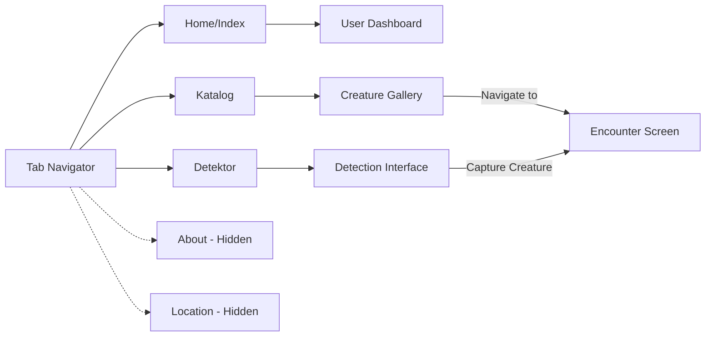

# Navigation Structure Report: Stack and Tabs Usage in Pokemon-like App

## Overview
This React Native/Expo project implements a Pokemon-like creature collection app with a sophisticated navigation structure using **Expo Router** with both Stack and Tab navigators. The app features authentication-protected routes and conditional navigation based on user state.

## Navigation Architecture

### 1. Root Layout Structure (`app/_layout.tsx`)

The app follows a **hierarchical provider pattern** with the root layout acting as the main navigation controller:

```
ThemeProvider
└── UserProvider
    └── CatalogProvider
        └── InsideUserProvider (Navigation Logic)
            └── Stack Navigator with Protected Routes
```

#### Key Components:
- **Stack Navigator**: Main navigation container
- **Stack.Protected**: Custom protected route wrapper
- **Authentication Guards**: `loggedIn` and `loggedOut` states

### 2. Authentication Flow Diagram

```mermaid
graph TD
    A[App Launch] --> B{Auth Check}
    B -->|Loading| C[Show Splash Screen]
    B -->|User Exists| D[Set loggedIn = true]
    B -->|No User| E[Set loggedOut = true]
    
    D --> F[Protected Routes Active]
    E --> G[Auth Routes Active]
    
    F --> H[(tabs) - Tab Navigator]
    F --> I[encounter - Stack Screen]
    
    G --> J[login - Stack Screen]
    G --> K[signup - Stack Screen]
    
    J -->|Successful Login| D
    K -->|Successful Signup| D
```

### 3. Stack Navigator Configuration

The Stack navigator uses **conditional rendering** with protected routes:

#### Protected Routes (Logged In Users):
- `(tabs)` - Tab Navigator (headerShown: false)
- `encounter` - Creature encounter screen (headerShown: true)

#### Auth Routes (Logged Out Users):
- `(auth)/login` - Login screen (headerShown: false)
- `(auth)/signup` - Signup screen (headerShown: false)

```typescript
<Stack.Protected guard={loggedIn}>
  <Stack.Screen name="(tabs)" options={{ headerShown: false }} />
  <Stack.Screen name="encounter" options={{ headerShown: true }} />
</Stack.Protected>

<Stack.Protected guard={loggedOut}>
  <Stack.Screen name="(auth)/login" options={{ headerShown: false }} />
  <Stack.Screen name="(auth)/signup" options={{ headerShown: false }} />
</Stack.Protected>
```

### 4. Tab Navigator Structure (`app/(tabs)/_layout.tsx`)

The Tab navigator manages the main app functionality with **5 tabs** (2 hidden for debugging):

#### Visible Tabs:
1. **Home (index)** - Main dashboard with user info
2. **Katalog** - Creature collection gallery
3. **Detektor** - Creature detection and capture

#### Hidden Tabs (Debug):
4. **About** - Debug information (`href: null`)
5. **Location** - Location debugging (`href: null`)



### 5. Navigation Flow Patterns

#### Main User Journey:
```
Launch → Auth Check → Login/Signup → Tab Navigator → Feature Screens
```

#### Creature Interaction Flow:
```
Detektor Tab → Detect Creature → Capture → Encounter Screen → Back to Detektor
Katalog Tab → Select Creature → Encounter Screen → Back to Katalog
```

### 6. Screen Hierarchy

```
Root Layout (Stack)
├── Protected Routes (loggedIn)
│   ├── (tabs) - Tab Navigator
│   │   ├── index.tsx - Home Screen
│   │   ├── katalog.tsx - Creature Gallery
│   │   ├── detektor.tsx - Creature Detector
│   │   ├── about.tsx - Debug (Hidden)
│   │   └── location.tsx - Debug (Hidden)
│   └── encounter.tsx - Creature Detail
├── Auth Routes (loggedOut)
│   ├── (auth)/login.tsx - Login Form
│   └── (auth)/signup.tsx - Registration Form
└── +not-found.tsx - 404 Screen
```

## Technical Implementation Details

### 1. Authentication Integration

The navigation system is tightly integrated with the **user context**:

- `useUser()` hook provides authentication state
- `authChecked` boolean prevents premature navigation
- Splash screen remains visible until auth state is determined
- Automatic redirection based on authentication status

### 2. Route Protection

**Stack.Protected** component:
- Guards routes based on boolean conditions
- `guard={loggedIn}` - Shows routes only when user is authenticated
- `guard={loggedOut}` - Shows routes only when user is not authenticated
- Prevents unauthorized access to protected content

### 3. Navigation State Management

The app uses **React Context** for state management:
- **UserProvider**: Authentication state and user data
- **CatalogProvider**: Creature collection data
- **ThemeProvider**: UI theming

### 4. Dynamic Tab Configuration

The Katalog tab demonstrates **conditional navigation**:
```typescript
options={{
  href: catalog ? (catalog.length > 0 ? undefined : null) : null,
  tabBarBadge: "!",
}}
```
- Tab is hidden if catalog is empty or loading
- Badge indicator shows available content

## Navigation Patterns Used

1. **Stack Navigation**: Primary navigation container
2. **Tab Navigation**: Main app functionality
3. **Protected Routes**: Authentication-based access control
4. **Conditional Rendering**: Dynamic route availability
5. **Context Integration**: State-driven navigation
6. **Modal/Screen Transitions**: Encounter screen overlay

## Key Features

- ✅ **Authentication-Protected Navigation**
- ✅ **Conditional Tab Visibility**
- ✅ **State-Driven Route Access**
- ✅ **Splash Screen Management**
- ✅ **Debug Route Hiding**
- ✅ **Context-Integrated Navigation**
- ✅ **Cross-Screen Data Passing**

## Strengths

1. **Clear Separation**: Auth and main app flows are distinctly separated
2. **Protection**: Robust route protection prevents unauthorized access
3. **Flexibility**: Dynamic tab configuration based on app state
4. **User Experience**: Smooth transitions between auth and main app
5. **Maintainability**: Context-based state management

## Areas for Improvement

1. **Deep Linking**: Could implement better deep link handling
2. **Navigation History**: More sophisticated back navigation
3. **Error Boundaries**: Navigation-specific error handling
4. **Performance**: Route-based code splitting possibilities
5. **Accessibility**: Enhanced navigation for screen readers

---

This navigation structure effectively separates concerns between authentication and main application functionality while providing a smooth user experience through conditional routing and state management.